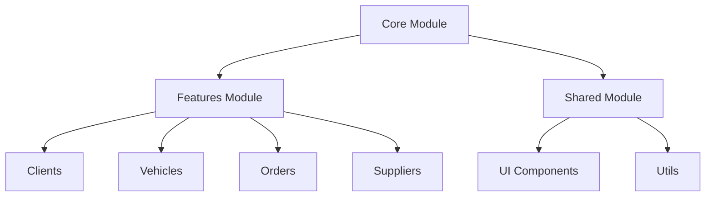
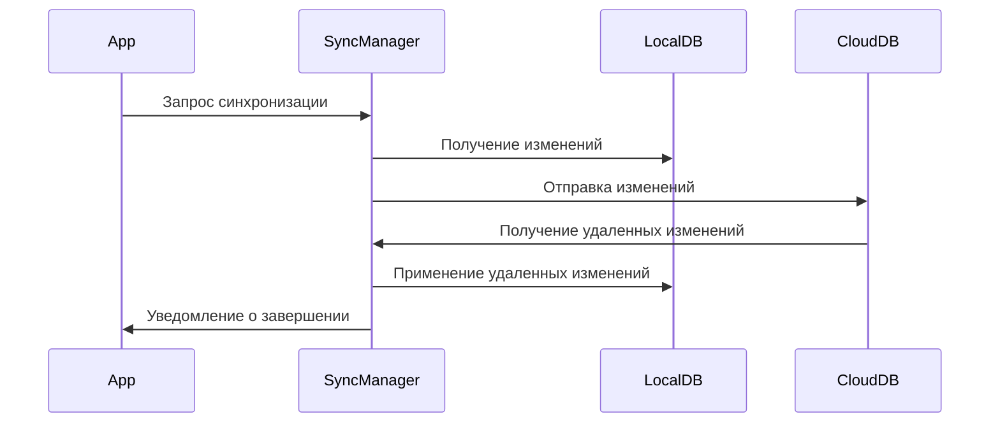
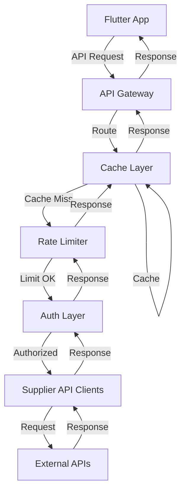
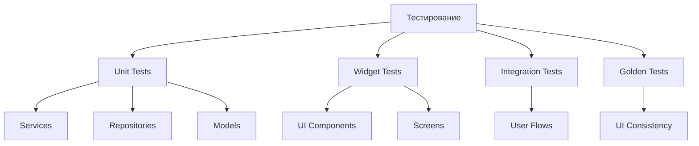

# Рекомендации по развитию проекта Part Catalog

> Документ содержит комплексные рекомендации по дальнейшему развитию и улучшению проекта Part Catalog на основе анализа его архитектуры и структуры.

## Содержание

1. [Архитектурные рекомендации](#1-архитектурные-рекомендации)
2. [Рекомендации по работе с данными](#2-рекомендации-по-работе-с-данными)
3. [Интеграция с API поставщиков](#3-интеграция-с-api-поставщиков)
4. [Улучшение UI/UX](#4-улучшение-uiux)
5. [Производительность и оптимизация](#5-производительность-и-оптимизация)
6. [Тестирование и качество кода](#6-тестирование-и-качество-кода)
7. [Безопасность](#7-безопасность)
8. [Масштабирование и развитие](#8-масштабирование-и-развитие)
9. [Документация и обучение](#9-документация-и-обучение)
10. [Дорожная карта развития](#10-дорожная-карта-развития)

## 1. Архитектурные рекомендации

### Усиление модульности

- **Микрофронтенды**: Рассмотрите возможность организации каждого модуля (клиенты, автомобили, заказ-наряды, поставщики) как полностью независимые микрофронтенды с собственными репозиториями, моделями и UI
- **Границы модулей**: Четко определите API между модулями, минимизируя прямые зависимости
- **Инверсия зависимостей**: Используйте интерфейсы для взаимодействия между модулями, чтобы уменьшить связанность

### Оптимизация слоев

- **Унификация интерфейсов репозиториев**: Создайте базовый интерфейс репозитория с общими методами CRUD
- **Разделение сервисов**: Выделите бизнес-логику в отдельные сервисы, не смешивая с логикой UI
- **Медиаторы**: Рассмотрите использование паттерна Медиатор для коммуникации между модулями

## 2. Рекомендации по работе с данными

### Локальное хранение

- **Миграции Drift**: Автоматизируйте миграции схемы БД с версионированием
- **Индексирование**: Добавьте индексы для часто запрашиваемых полей (особенно для поиска по VIN, артикулам запчастей)
- **Кэширование запросов**: Реализуйте двухуровневое кэширование (память + диск)

### Облачная синхронизация

- **Стратегия разрешения конфликтов**: Реализуйте четкую стратегию для разрешения конфликтов при синхронизации
- **Частичная синхронизация**: Поддержка синхронизации только выбранных данных для экономии трафика
- **Фоновая синхронизация**: Реализуйте механизм фоновой синхронизации с возможностью отслеживания прогресса

## 3. Интеграция с API поставщиков

### Улучшение адаптивной архитектуры API

- **Фабрика клиентов API**: Расширьте фабрику для динамического создания клиентов API на основе конфигурации
- **Стратегия отказоустойчивости**: Реализуйте механизмы повторных попыток, таймаутов и Circuit Breaker
- **Мониторинг API**: Добавьте систему мониторинга для отслеживания производительности и доступности API

### Оптимизация прокси-сервера

- **Кластеризация**: Настройте кластер прокси-серверов для повышения доступности
- **Распределенное кэширование**: Используйте Redis для кэширования между экземплярами прокси-сервера
- **Аналитика запросов**: Добавьте сбор метрик по запросам для оптимизации

## 4. Улучшение UI/UX

### Адаптивный дизайн

- **Компонентный подход**: Создайте библиотеку переиспользуемых UI-компонентов с поддержкой разных форм-факторов
- **Responsive Layout**: Используйте LayoutBuilder и MediaQuery для адаптации UI под разные размеры экрана
- **Платформо-специфичные адаптации**: Учитывайте особенности разных платформ (Windows, macOS, iOS, Android)

### Оптимизация пользовательского опыта

- **Скелетонная загрузка**: Замените обычные индикаторы загрузки на скелетонную анимацию
- **Оффлайн-режим**: Улучшите UX при отсутствии интернет-соединения
- **Прогрессивное раскрытие**: Реализуйте интерфейс с постепенным раскрытием сложности

## 5. Производительность и оптимизация

### Оптимизация Flutter

- **Кэширование виджетов**: Используйте const конструкторы и RepaintBoundary для оптимизации перерисовок
- **Ленивая загрузка**: Реализуйте отложенную загрузку тяжелых компонентов и данных
- **Виртуализация списков**: Используйте ListView.builder вместо Column для длинных списков

### Оптимизация запросов к БД

- **Пакетные операции**: Группируйте операции с БД для уменьшения количества транзакций
- **Денормализация**: Для часто запрашиваемых данных рассмотрите возможность денормализации
- **Асинхронная загрузка**: Используйте изоляты (Isolates) для тяжелых операций с данными

## 6. Тестирование и качество кода

### Стратегия тестирования

- **Покрытие кода**: Стремитесь к покрытию тестами не менее 80% кода
- **Интеграционные тесты**: Автоматизируйте тестирование ключевых пользовательских сценариев
- **Тестирование производительности**: Добавьте тесты для отслеживания производительности приложения

### Статический анализ

- **Lint правила**: Настройте строгие правила линтера для обеспечения качества кода
- **Автоматический форматтер**: Настройте автоматическое форматирование кода при коммите
- **Анализ зависимостей**: Регулярно проверяйте и обновляйте зависимости

## 7. Безопасность

### Защита данных

- **Шифрование**: Реализуйте шифрование чувствительных данных в локальной БД
- **Безопасное хранение**: Используйте flutter_secure_storage для хранения API-ключей и токенов
- **Санитизация данных**: Проверяйте и очищайте все входящие данные от пользователя и API

### Аутентификация и авторизация

- **Многофакторная аутентификация**: Добавьте поддержку 2FA для повышения безопасности
- **Управление сессиями**: Реализуйте механизм автоматического обновления токенов
- **Ролевой доступ**: Внедрите систему ролей и разрешений для разных типов пользователей

## 8. Масштабирование и развитие

### Подготовка к масштабированию

- **Модульная архитектура**: Обеспечьте возможность добавления новых модулей без изменения существующего кода
- **Абстракции**: Используйте абстракции для всех внешних зависимостей
- **Конфигурируемость**: Вынесите все настройки в конфигурационные файлы

### Мониторинг и аналитика

- **Логирование**: Внедрите структурированное логирование с разными уровнями детализации
- **Аналитика использования**: Добавьте сбор метрик использования для выявления популярных функций
- **Отслеживание ошибок**: Интегрируйте систему отслеживания ошибок (например, Firebase Crashlytics)

## 9. Документация и обучение

### Улучшение документации

- **Автоматическая генерация**: Настройте автоматическую генерацию документации API
- **Руководства для разработчиков**: Создайте подробные руководства по работе с кодовой базой
- **Примеры использования**: Добавьте примеры кода для типичных сценариев

### Обучение пользователей

- **Интерактивные подсказки**: Добавьте подсказки и обучающие элементы в интерфейс
- **Видеоуроки**: Создайте короткие видеоуроки по основным функциям приложения
- **База знаний**: Разработайте базу знаний с ответами на часто задаваемые вопросы

## 10. Дорожная карта развития

### Краткосрочные цели (1-3 месяца)

- Стабилизация существующих модулей
- Улучшение производительности и UX
- Расширение тестового покрытия

### Среднесрочные цели (3-6 месяцев)

- Интеграция с дополнительными API поставщиков
- Улучшение облачной синхронизации
- Добавление аналитики и мониторинга

### Долгосрочные цели (6-12 месяцев)

- Расширение функциональности для новых бизнес-сценариев
- Интеграция с системами бухгалтерского учета
- Разработка мобильного приложения для клиентов СТО

## Заключение

Проект Part Catalog имеет хорошо продуманную архитектуру и структуру, которая обеспечивает надежную основу для дальнейшего развития. Следуя предложенным рекомендациям, вы сможете улучшить качество кода, производительность, безопасность и масштабируемость приложения.

Ключевые приоритеты для дальнейшего развития:
1. Усиление модульности и четкое разделение ответственности
2. Оптимизация работы с данными и API
3. Улучшение пользовательского опыта на разных платформах
4. Расширение тестового покрытия
5. Подготовка к масштабированию